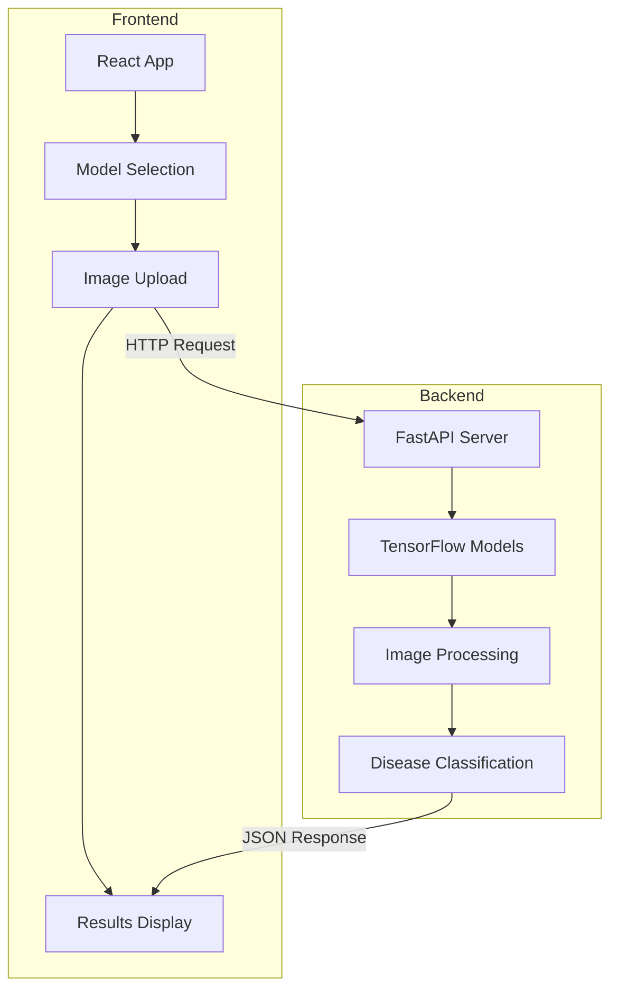
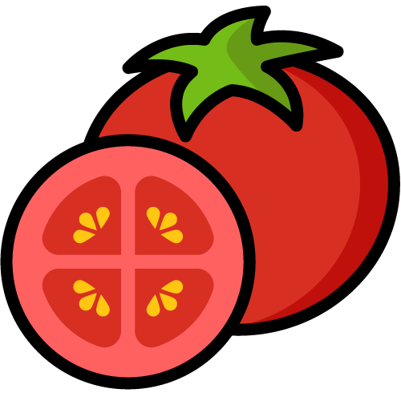
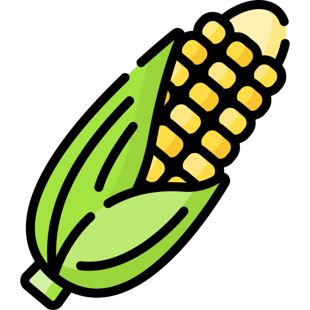

# 🌿 Plant Disease Detection (PDD) System

<div align="center">
  
  
  <h2>AI-Powered Plant Disease Detection System</h2>

  [](https://fastapi.tiangolo.com/)
  [](https://reactjs.org/)
  [](https://www.tensorflow.org/)
  [](https://www.python.org/)
  [](https://material-ui.com/)
  [](https://developer.mozilla.org/en-US/docs/Web/JavaScript)
  [](https://www.typescriptlang.org/)

  <p align="center">
    <a href="#-key-features">Key Features</a> •
    <a href="#-system-architecture">Architecture</a> •
    <a href="#-quick-start">Quick Start</a> •
    <a href="#-supported-plants">Plants</a> •
    <a href="#-tech-stack">Tech Stack</a> •
    <a href="#-api-reference">API</a>
  </p>
</div>

## 🌟 Key Features

<div align="center">
  <table>
    <tr>
      <td align="center">
        <br/>
        <b>AI-Powered Analysis</b><br/>
        <sub>Advanced ML models</sub>
      </td>
      <td align="center">
        <br/>
        <b>Real-time Detection</b><br/>
        <sub>Instant results</sub>
      </td>
      <td align="center">
        <br/>
        <b>Cross-platform</b><br/>
        <sub>Works everywhere</sub>
      </td>
      <td align="center">
        <br/>
        <b>Fast Processing</b><br/>
        <sub>Optimized backend</sub>
      </td>
    </tr>
    <tr>
      <td align="center">
        <br/>
        <b>Easy Upload</b><br/>
        <sub>Drag & drop support</sub>
      </td>
      <td align="center">
        <br/>
        <b>Multi-plant Support</b><br/>
        <sub>4 plant types</sub>
      </td>
      <td align="center">
        <br/>
        <b>Efficient Storage</b><br/>
        <sub>Optimized data handling</sub>
      </td>
      <td align="center">
        <br/>
        <b>Secure System</b><br/>
        <sub>Protected endpoints</sub>
      </td>
    </tr>
  </table>
</div>

## 🏗 System Architecture

### High-Level Overview


## 🚀 Quick Start

### Prerequisites
<div align="center">
  <table>
    <tr>
      <td align="center">
        <br/>
        Python ≥ 3.8
      </td>
      <td align="center">
        <br/>
        Node.js ≥ 14
      </td>
      <td align="center">
        <br/>
        npm ≥ 6
      </td>
    </tr>
  </table>
</div>

### Backend Setup
```bash
# Clone repository
git clone https://github.com/mohamedhaitham22/Plant-Diseases-Detection-using-CNN.git
cd plant-disease-detection

# Setup Python environment
python -m venv venv
source venv/bin/activate  # Windows: .\venv\Scripts\activate

# Install dependencies
cd backend
pip install -r requirements.txt

# Configure environment
cp .env.example .env
# Edit .env with your model paths

# Start server
uvicorn main:app --reload --host 0.0.0.0 --port 8000
```

### Frontend Setup
```bash
# Navigate to frontend
cd frontend

# Install dependencies
npm install

# Start development server
npm start
```

## 🌿 Supported Plants

<div align="center">
  <table>
    <tr>
      <td align="center" width="200">
        <br/>
        <h3>🍅 Tomato</h3>
        <details>
          <summary>View Conditions</summary>
          • Bacterial spot<br/>
          • Early blight<br/>
          • Late blight<br/>
          • Leaf Mold<br/>
          • Septoria leaf spot<br/>
          • Spider mites<br/>
          • Yellow Leaf Curl Virus<br/>
          • Target Spot<br/>
          • Mosaic virus<br/>
          • Healthy
        </details>
      </td>
      <td align="center" width="200">
        <br/>
        <h3>🥔 Potato</h3>
        <details>
          <summary>View Conditions</summary>
          • Early blight<br/>
          • Late blight<br/>
          • Healthy
        </details>
      </td>
      <td align="center" width="200">
        <br/>
        <h3>🍇 Grape</h3>
        <details>
          <summary>View Conditions</summary>
          • Black rot<br/>
          • Esca (Black Measles)<br/>
          • Leaf blight<br/>
          • Healthy
        </details>
      </td>
      <td align="center" width="200">
        <br/>
        <h3>🌽 Corn</h3>
        <details>
          <summary>View Conditions</summary>
          • Cercospora leaf spot<br/>
          • Common rust<br/>
          • Northern Leaf Blight<br/>
          • Healthy
        </details>
      </td>
    </tr>
  </table>
</div>

## 💻 Tech Stack

### Frontend Technologies
<div align="center">
  
  
  
  
  
  
</div>

### Backend Technologies
<div align="center">
  
  
  
  
  
</div>

## 📡 API Reference

### Endpoints

| Method | Endpoint | Description |
|--------|----------|-------------|
| GET | `/ping` | Health check |
| POST | `/predict/{model_id}` | Disease prediction |

### Request Format
```json
{
  "file": "binary_image_data"
}
```

### Response Format
```json
{
  "class": "disease_name",
  "confidence": 0.95
}
```

## 🔧 Configuration

### Backend Environment Variables
```env
MODEL_PATH_PLANT_CLASSIFIER=path/to/classifier/model
TOMATO_MODEL=path/to/tomato/model
POTATO_MODEL=path/to/potato/model
GRAPE_MODEL=path/to/grape/model
CORN_MODEL=path/to/corn/model
```

### Frontend Environment Variables
```env
REACT_APP_API_URL=http://localhost:8000/predict
```

## 📱 Mobile Support

<div align="center">
  <table>
    <tr>
      <td align="center">
        <br/>
        Android
      </td>
      <td align="center">
        <br/>
        iOS
      </td>
      <td align="center">
        <br/>
        Windows
      </td>
    </tr>
  </table>
</div>

## 🤝 Contributing

Contributions are welcome! Please feel free to submit a Pull Request.

<div align="center">
  
</div>

## 📄 License

This project is licensed under the MIT License - see the [LICENSE](LICENSE) file for details.

## 🙏 Acknowledgments

<div align="center">
  <table>
    <tr>
      <td align="center">
        <br/>
        TensorFlow
      </td>
      <td align="center">
        <br/>
        FastAPI
      </td>
      <td align="center">
        <br/>
        React
      </td>
      <td align="center">
        <br/>
        Material-UI
      </td>
    </tr>
  </table>
</div>

---

<div align="center">
  
  <br/>
  <sub>© 2024 Plant Disease Detection Team. All rights reserved.</sub>
</div>
